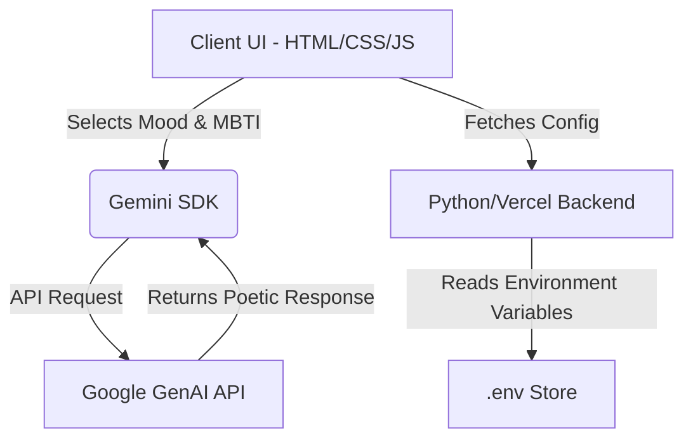

<div align="center">
  <h1>🌌 Mood Weaver</h1>
  <p><strong>An immersive, AI-powered artistic experience that transforms emotional states into poetic masterpieces.</strong></p>

  [](https://opensource.org/licenses/MIT)
  [](https://vercel.com/)
  [](https://aistudio.google.com/)
</div>

<br />

## 📖 Table of Contents
- [About the Project](#-about-the-project)
- [Key Features](#-key-features)
- [Architecture](#-architecture)
- [Tech Stack](#-tech-stack)
- [Getting Started](#-getting-started)
- [Deployment](#-deployment)
- [License](#-license)

---

## 🎯 About the Project
**Mood Weaver** bridges the gap between human feeling and generative intelligence. By analyzing your MBTI personality profile and current emotional state, the application weaves personalized, artistic, and poetic snippets tailored specifically to how you experience the world.

---

## ✨ Key Features
- **🎭 Personality-Driven Art**: Leverages MBTI personality traits to tailor the poetic output, ensuring the "voice" of the artwork resonates with your psychological profile.
- **🌈 Dynamic Atmospheric UI**: 14 unique visual themes that shift the entire application's mood, lighting, and color palette in real-time.
- **🧠 Generative Intelligence**: Powered by Google's latest **Gemini 2.5 Flash** model for high-speed, high-quality creative writing.
- **🖱️ Immersive Interactions**: Features a cursor-following atmospheric light effect and smooth, motion-driven transitions using Glassmorphism.
- **📋 Creative Export**: One-click "Copy to Clipboard" functionality to share your woven art.

---

## 📐 Architecture
The application follows a clean, decoupled architecture:



- **Presentation Layer**: Built with `index.html` and `style.css`, utilizing a custom theme system based on CSS variables and responsive design principles.
- **Intelligence Layer**: Client-side async service interfacing with the `@google/genai` module.
- **Backend Layer**: A lightweight Python serverless framework that securely delivers configuration details.

---

## 🛠️ Tech Stack
- **Frontend**: Vanilla HTML5, CSS3, JavaScript (ES Modules)
- **Design System**: Advanced Glassmorphism & Custom CSS properties
- **AI Engine**: Google GenAI SDK (`@google/genai`)
- **Backend Function**: Python `BaseHTTPRequestHandler` / Vercel Serverless

---

## 🚀 Getting Started

To run the application locally, follow these steps:

### Prerequisites
- Python 3.9+
- A Google Gemini API Key from [Google AI Studio](https://aistudio.google.com/)

### Installation
1. **Clone the repository**:
   ```bash
   git clone https://github.com/your-username/mood-weaver.git
   cd mood-weaver
   ```

2. **Configure Environment Variables**:
   Copy the example environment file:
   ```bash
   cp .env.example .env
   ```
   *Note: If you are using Windows, you can simply rename the file and set your key inside.*

   Then, optionally export it to your terminal:
   ```bash
   export GEMINI_API_KEY="your_api_key_here"
   ```

3. **Start the local server**:
   ```bash
   python3 server.py
   ```
4. Open your browser and navigate to `http://localhost:3000`.

---

## ☁️ Deployment (Vercel)
This project is fully optimized for zero-config deployment on Vercel as a static app with Serverless Python routes.

1. Push your repository to GitHub.
2. Go to your [Vercel Dashboard](https://vercel.com/dashboard) and create a **New Project**.
3. Import the `mood-weaver` repository.
4. **Important**: Add `GEMINI_API_KEY` to the **Environment Variables** section in the Vercel project settings.
5. Click **Deploy**. Vercel will automatically host the static files and detect `/api/config.py` as a backend serverless function based on the `vercel.json` routing configuration!

---

## 📄 License
This project is licensed under the MIT License - see the `LICENSE` file for details.

<br />

<p align="center">
  <i>Weave your emotions into art.</i><br/>
  Made with 🖤 by the <b>Mood Weaver Team</b>
</p>
